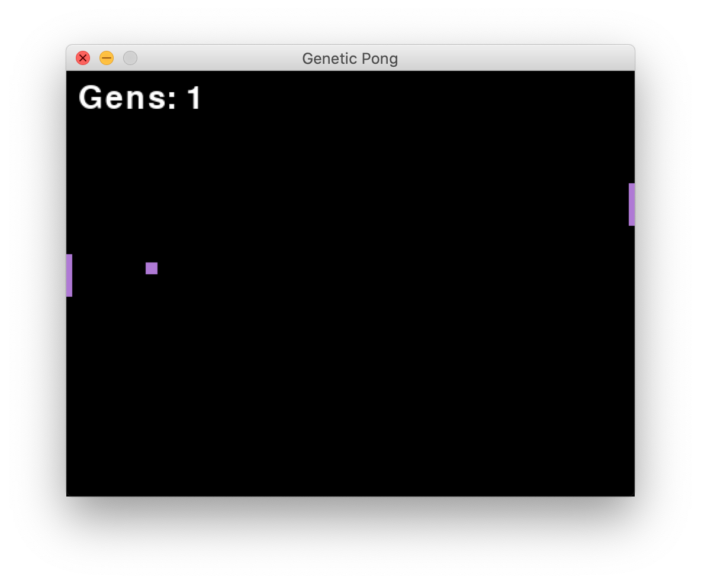
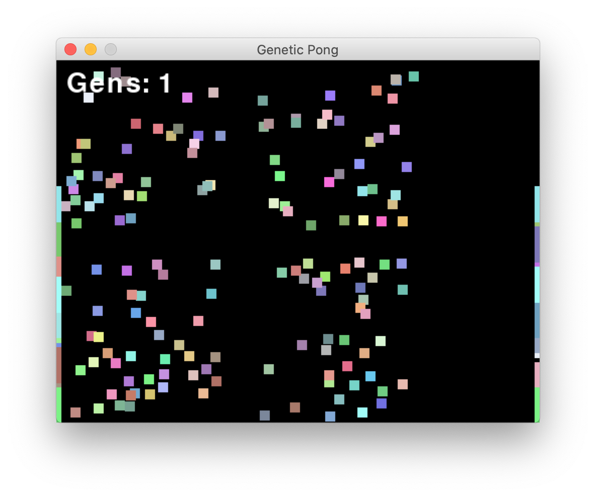

# NEAT Pong
Neat pong is a program that teaches AIs how to play pong using Neural Evolution of Augmenting Topologies a genetic evolution approach to Machine Learning.

## Getting Started
1. To install first clone the repository
2. Check that you have python 3.x
3. run "pip install -r requirements.txt" or "pip3 install -r requirements.txt" if on mac in your terminal or command prompt
4. run the file like any other python script "python3 pong.py" and enjoy!

If at any point you run into an issue be that running the code or you have a question about how it works feel free to reach out and message me!

## How it works
The algorithm has many models separated into different "species" in a population. The population is then put into pong and rated on how well they do each generation. The models are given points or fitness every time they hit the ball and every frame they are alive. The model can die if it misses the pong ball and no longer will receive fitness for that generation. The best performing models of each species will be breaded and create the models for the next generation. The environment will keep running generations until one of the models hits a threshold of fitness at which point it will end and return the model.

The environment is run with 150 different models at once separated into different species based on their neural network structures. A model consists of two paddles, a left and right, and a ball, and can be differntiated from other models by a unique color like such: 

When all the models are training at once it looks like such:

A little chaotic!

Here it is in action:

See the full demo on youtube here: https://youtu.be/4v4DcH7Wm5w

## Conclusions
Beginning this project I initially trained a model using a Keras/Tensorflow model and data from playing myself. However, due to biased data in my recordings, the model simply didn't know what to do and over generalized. That strategy ultimately didn't work and required a lot of time recording the data for the model. With the genetic/NEAT approach this data recording was not needed. The models learned on its own over time. 
The problem itself wasn't too difficult. The model had two options move up or down, or if it wasn't confident enough it wouldn't move at all. I fed the model the X and Y position of the ball and the Y coordinate of the paddle. It appeared that the model didn't have a sense of direction since no recurrent net was used and no direction or vector was given for what way the ball was moving leading to the paddles moving almost together even though two separate neural networks were used for each paddle. Using the NEAT algorithm, on average I found that with the starting population of 150, a model could beat the environment (surpass the fitness threshold) between 1-10 generations. The lower the populations the more generations on average are needed to beat the environment.

## Acknowledgements
I am using the neat-python module. You can find their module and repository [here](https://github.com/CodeReclaimers/neat-python)

Additional reading about neat can be find [here](http://www.cs.utexas.edu/~ai-lab/pubs/stanley.gecco02_1.pdf) from Kenneth O. Stanley's paper.

